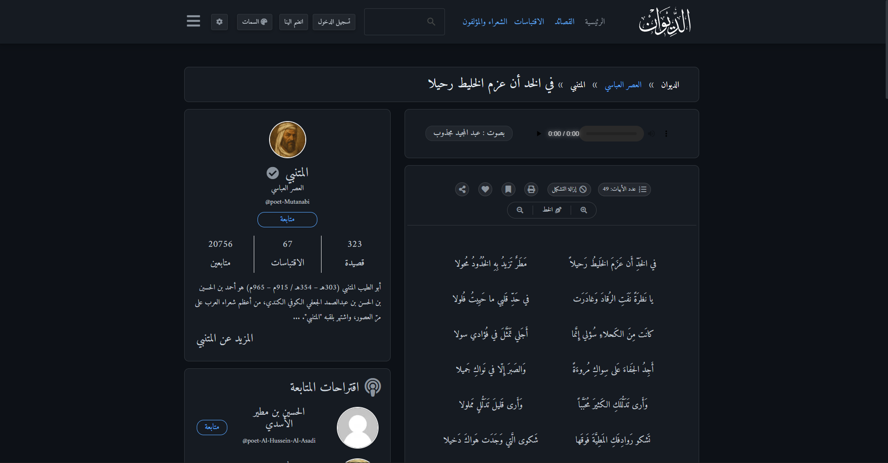
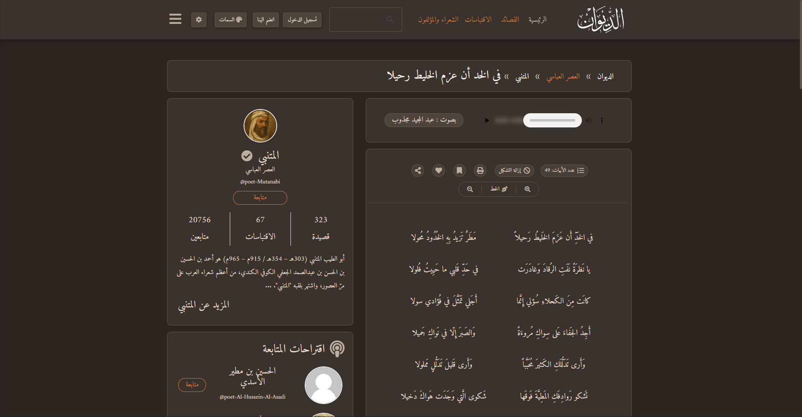
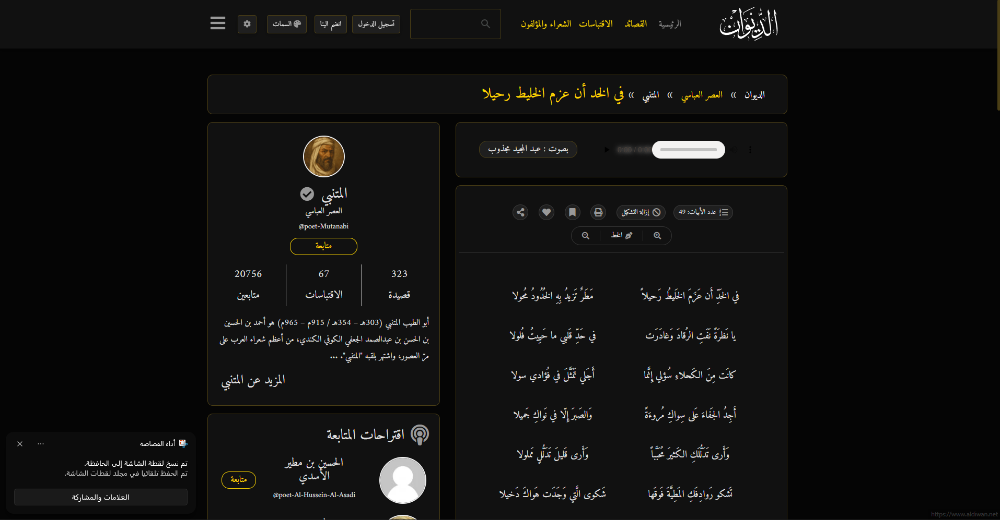
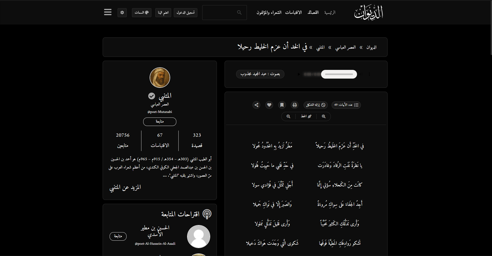
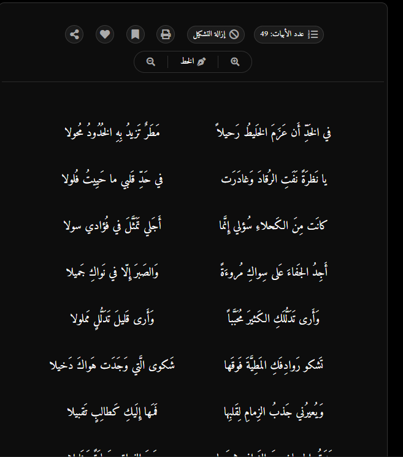
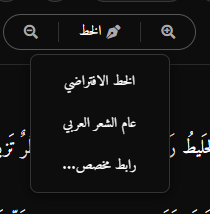
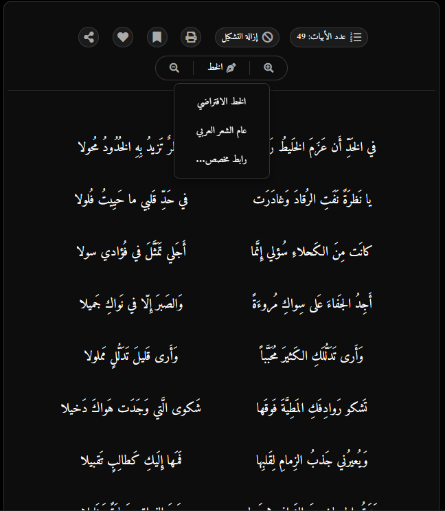
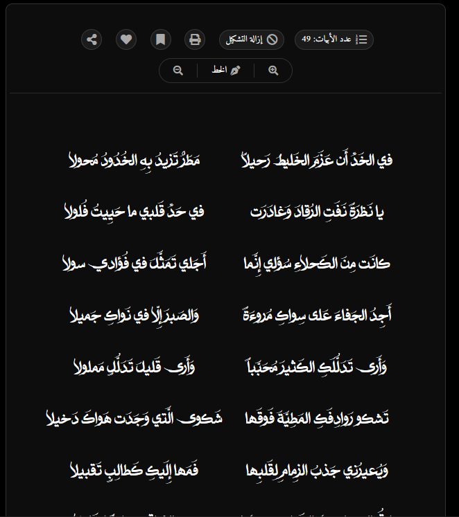

# إضافة الديوان الذكية (Aldiwan Smart Extension)

إضافة مخصصة لمتصفح جوجل كروم تهدف إلى تحسين تجربة قراءة الشعر في موقع [الديوان](https://www.aldiwan.net/) وتوفير أدوات قوية لنسخ الأبيات الشعرية.

---

## المميزات

- **الوضع الليلي (Dark Mode):** قراءة مريحة للعين في الأوقات المتأخرة وحماية من الإضاءة الساطعة.
- **تغيير السمات والخطوط:** إمكانية تغيير خط القصائد إلى خطوط عربية جميلة مثل "عام الشعر العربي" (أو خطوط مخصصة أخرى) لتجربة قراءة أكثر أصالة.
- **النسخ الذكي للأبيات:** نسخ القصيدة بشكل مرتب وأنيق عبر تحديد الأبيات والضغط بزر الفأرة الأيمن (Right-Click) واختيار "نسخ الأبيات بشكل منسق"، حيث يتم فصل الصدر عن العجز وتنسيق كل بيت في سطرين بشكل تلقائي.
- **تحكم مرن بحجم الخط:** أزرار لتكبير وتصغير حجم خط القصيدة بكل سهولة دون الحاجة لتكبير باقي عناصر الموقع.
- **إخفاء/إظهار الزخارف:** إمكانية إخفاء الزخارف الشعرية للحصول على تجربة قراءة أنظف وأكثر تركيزاً.

## الثيمات (Themes)
تتوفر الإضافة بعدة ألوان مريحة للعين لترضي جميع الأذواق:

### 1. الافتراضي (Dark)

### 2. قهوة دافئة (Sepia)

### 3. ذهبي وأسود (Gold)

### 4. أسود خالص (OLED Black)

## تخصيص الخطوط والأبيات (Typography & Verses)
تتيح لك الإضافة التحكم الكامل في شكل وحجم الأبيات الشعرية لتجربة قراءة مثالية:

### الخط الأساسي للموقع (الافتراضي)

### قائمة تغيير الخط
يمكنك فتح القائمة المنسدلة لاختيار خطك المفضل بكل سهولة:

### استعراض الخطوط
يمكنك رؤية تأثير الخطوط على الأبيات مباشرة:

### النتيجة: الخط المخصص (عام الشعر العربي)
بعد الاختيار، ستستمتع بخطوط عربية أصيلة وأكثر جمالاً:

## طريقة التثبيت

1. قم بالذهاب إلى صفحة [الإصدارات (Releases)](https://github.com/monesir/daiwan/releases) في هذا المستودع.
2. قم بتحميل أحدث ملف مضغوط للإضافة (مثال: `aldiwan_extension_v1.9.4.zip`) وفك الضغط عنه في مجلد على جهازك.
3. افتح متصفح كروم وانتقل إلى صفحة الإضافات عبر الرابط: `chrome://extensions/`.
4. قم بتفعيل خيار **Developer mode** (وضع المطور) الموجود في الزاوية العلوية اليمنى.
5. اضغط على زر **Load unpacked** (تحميل إضافة غير معبأة) واختر المجلد الذي قمت بفك الضغط عنه.
6. استمتع بتجربة محسّنة في موقع الديوان!

---
*تم تطوير هذه الإضافة لتسهيل قراءة وتوثيق الشعر العربي لمستخدمي موقع الديوان.*
